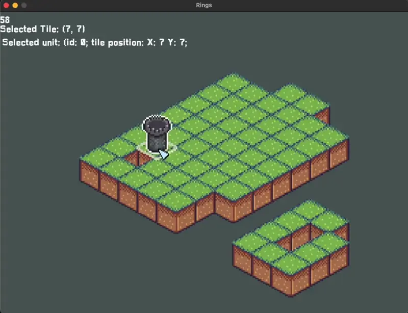

In the [last post](/blog/the-refactoring-process-in-rings-code) I presented you the Rings project, a repository where I (Renato) started implementing some basic systems that I would use in game development in the future. First, as I said in the last post, the idea was to make a rogue-like top-down shooter, but some days ago, I decided that to keep it simple and with the least amount of complexity, Rings should be a Tower Defense game.

# The complexity thing
When you start to think about how to manage multiple abilities that interfere with one another; hundreds of bullets can collide, bounce, go back and pass through stuff. You start to think that Python and Pygame maybe is not the right choice for the job, and starting everything from zero with a new language is kind of a hard decision as well.

But now imagine a game with static units, fixed targets, simple upgrades, and a stateless game loop, you can accept Python as a decent tool for the job.

But, to add more dynamics to the game, I decided to implement an isometric style. The main idea was to bring the semi-3D perspective and the strategi feeling that this kind of graphics brings to games. The first games of **Age of Empires** used those graphics for example. And I think that this is a way to make things more challenging.

# New inspirations and the main idea
Since the rogue-like games exploded in the last few years, the idea is to go against this, for more strategic gameplay. Recently I played [Rogue Tower](https://store.steampowered.com/app/1843760/Rogue_Tower/), rogue-like tower-defense with voxel graphics, its a pretty fun game, but I get bored with it after the first plays, the range of builds is not diverse enough that you want to experiment with other types of stats and machines. 

A game that does this part very well is [ Despot's Game: Dystopian Army Builder](https://store.steampowered.com/app/1227280/Despots_Game_Dystopian_Army_Builder/), which goes for an auto-battle (TFT vibes) with class combinations and power-ups. 

So, the idea is to mess up with those concepts in a [Bloons TD 6](https://www.google.com/url?sa=t&rct=j&q=&esrc=s&source=web&cd=&cad=rja&uact=8&ved=2ahUKEwjH36jBtbX6AhV7s5UCHYc0ALMQFnoECAsQAQ&url=https%3A%2F%2Fstore.steampowered.com%2Fapp%2F960090%2FBloons_TD_6%2F&usg=AOvVaw1Q3-OUytRLn3tVpRT1PUBm) style as well. With a variety of units each one with its purpose and class, so you can play with those kinds of combinations.

Since I'm a noobie game developer, my ideas and implementations probably will go pretty badly, but the idea is to experiment with everything before making a serious game.

# The Game so far
It's important to say that we don't have any style concept formed so far, don't have gameplay and the base of Pygame start code continues there. For the first interactions of the game, I focused on doing the isometric stuff (that is harder than it looks). Then I created an `UnitManager` to take care of the unit placement and delete. 

To make the Unit selection I needed to work better on detecting which Tile and which Unit I was hovering with the mouse, It's kind of tricky but it does the job.

I still need to improve the isometric-to-plane logic, because now I'm stuck on the code to detect if an enemy enters a unit range, and I cannot use the isometric position straight ahead, I need to make some kind of conversion. I need to calculate those collisions in the flat plane and then, only transform to isometric when needed (to draw and calculate mouse collision with units). 

I made a simple shoot system just to try it out, but need to fix those collisions before showing anything. 

# Some problems
Finally, as things progress it get's harder to develop some stuf, that's why we should build things different. But at the same time we need to make things work before refactoring it. Another thing that I'm facing is unit testing problems.

What, where and how to test thing in a video-game code? Should you test it with all things turned on? (like graphics) Or should you just test the intern things like sub-functions? Given that things change brutly during early development, those test can start to requiring more work then the real code, and it's kind ok to do that, since those tests hold your software together and protected from future mistakes.

Anyways, I need to start testing as soon as possible. I Will write abou testing when I make it.