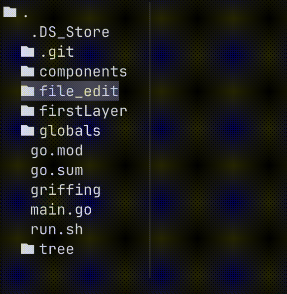

Olá a todos! Faz tempo que não escrevo por aqui, pois estive ocupado e não programando muito. Mas prometo que voltarei a trabalhar com joguinhos e coisas interessantes para que eu possa movimentar mais esse site.

Dessa vez estou trazendo um novo projeto, que comecei apenas como uma forma de experimentar TUIs (Terminal User Interfaces) e ter alguma coisa simples pra mexer de vez em quando sem ter que abrir 5 programas diferentes (Ah! o desenvolvimento mobile).

# A ideia
A ideia inicial do projeto apareceu pela necessidade de ter uma junção de:
1. Obsidian: criar, editar e organizar notas com facilidade
2. Zotero: Ler arquivos PDF e destacar trechos 
3. Inverter cores de um PDF pra não perder a visão (não devíamos ter mantido no computador o padrão da cor real do papel, não foi uma boa ideia)

Seria meio que um sistema para auxiliar na condução de pesquisas científicas, principalmente de revisão da literatura, junto com um diário de pesquisa e organização de tarefas.

Sim, um escopo gigantesco não é mesmo?! 

Nessa mesma época eu havia começado a estudar Go, e fiquei sabendo de uma ótima ferramenta para construir TUIs, o [Charm_](https://charm.sh). Na verdade o Charm é uma coleção de bibliotecas com esse propósito. Sabendo da existência dessa ferramenta fiquei com uma pulga atrás da orelha querendo construir algo com ela. Depois de tantos anos mexendo com CSS puro, interfaces gráficas de Flutter baseadas em OOP, o que faltava experimentar eram interfaces de terminal. (Não me faça lembrar de quando montei UIs em Java)

Enfim, acabei reduzindo o escopo do projeto a apenas um Obsidian de terminal, que eu pudesse pelo menos ler o conteúdo de um PDF. Sendo no terminal, não seria voltado para o usuário final, mas para os estranhos que curtem essas paradas. Ainda assim, acho a ideia de um Zotero modernizado boa, e não descartarei ela por completo (realmente odeio coisas feitas em Java, e se o Zotero é feito em java, ele deve morrer).

Eventualmente, um dia qualquer sozinho numa das minhas hambúrguerias favoritas, me bateu a inspiração pra começar esse projeto, aquele tipo de inspiração que começa por: "quer saber, eu vou fazer isso agora, e semana que vem estará feito". Falhei miseravelmente. 

# A primeira tentativa
Minha primeira tentativa foi muito mal sucedida, confesso. Após abrir a pasta e listar por todos os arquivos, através das funções oferecidas pelo pacote `os` da linguagem go, me vi com uma lista única de arquivos, sem a possibilidade de ter arquivos dentro de pastas, e nem pastas dentro de pastas. 

Óbvio, o sistema de arquivos são armazenados em árvore, então precisaria reconstruir essa arvore de arquivos enquanto itero sobre os arquivos do diretório selecionado (no caso o diretório do próprio projeto). Mas, pra alguém que tinha estudado árvore mais de 1 ano atrás, sem nunca ter implementado nada sobre elas, a ideia ainda estava confusa. 

Usando a abstração de árvore fornecida pelo Charm e muito ChatGPT, a única coisa que consegui foi uma confusão total e alguns código recursivos que não faziam sentido algum pra mim. 

Nesse momento, meu pedido havia chegado e eu tinha prioridades maiores na mesa.

# Reencontro de um problema
Como havia comentado no começo desse post, ainda estou ocupado finalizando alguns detalhes do meu bacharelado, mas ao mesmo tempo, não posso deixar de programar 100%, faz parte da minha natureza. 

Por isso, estava procurando algum projeto para trabalhar que não exigisse: anos de estudo de algum tópico extremamente específico (ffmpeg); nem a complexidade de um formato de arquivos de décadas de idade (PDFs); muito menos algo que fizesse meu cérebro queimar de tanta novidade e complexidade (Computação gráfica). Ao mesmo tempo procurava algum projeto que não exigisse programas ou procedimentos secundários, como abrir um servidor; abrir emuladores; game engine; dezenas de abas com documentação e perguntas do StackOverflow. 

Precisava de algo direto e que eu conhecesse minimamente, pra buscar aquela sensação de realização que só a programação, a criação de algo do absoluto (mais ou menos) zero, pode trazer.

Essas ideias circularam na minha cabeça quando pensava sobre o que programar. Quando me lembrei daquele maldito problema, de arvore de arquivos, que havia me derrotado meses.

Olhando em retrospecto parecia um problema simples: é uma lista de arquivos, mas ao encontrar uma pasta, cria uma nova lista e recomeça o processo do 0. Se fizer de forma recursiva e direta fica mais fácil do que parece.

> Cabe lembrar que, entre esses meses que se passaram, trabalhei em um dos mais apressados e complicados projetos que já tive na carreira. Onde aprendi sobre a importância de ser eficaz, direto e simples. Quando vi o problema pós-projeto, parecia muito mais simples do que quando encontrei-o pela primeira vez.

# Uma segunda olhada
Revisitando o projeto me deparei com algo que não reconhecia como minha criação, mas de fato era um frankenstein: junção de códigos da documentação do Charm, códigos gerados por LLVMs diferentes, e algumas suturas entre eles de minha autoria. 

Fiquei em dúvida: deveria apagar tudo e começar do zero? Ou deveria tentar salvar o que prestava (não muito). Confesso que cheguei a apagar o projeto, mas, delicadamente, recuperei-o da lixeira. Com fé de que havia algo de bom restante naquelas linhas confusas. 

Infelizmente não tenho como mostrar-lhes como estes códigos se pareciam (e acho que nenhum de vocês suportaria), pois na época não havia criado um repositório para o projeto, e não compartilhei com ninguém, pois o mundo era um lugar melhor sem aquelas linhas.

Apaguei maior parte do código, principalmente referente a geração da arvore e iteração sobre os arquivos. Naquela hora, decidir que iria implementar a estrura de árvore sem nenhuma abstração ou auxílio de terceiros, iria parar e pensar sobre como resolver aquele problema. E foi uma das melhores ideias que tive.

# A solução
A melhor forma de solucionar qualquer problema é simplesmente descontruí-lo até um ponto que se saiba resolver. Se uma árvore esta parecendo um problema complexo, simplifique-a para algo mais simples: uma árvore nada mais é do que um elemento que tem vários filhos (uma lista), sendo que esses filhos podem ter outros filhos, logo, uma árvore é uma lista com listas dentro, De forma que vire um looping possivelmente infinito.

Falando assim parece até idiota ter um semestre inteiro pra estudar grafos (brincadeira, a complexidade vem em outra parte dos grafos). 

Então a solução é simples: passar por todos os arquivos adicionando eles como filhos de um nó pai, quando achar uma pasta, fazer o mesmo para ela como se ela fosse o nó pai, quando chegar ao fim, insere todos os nós achados no nó atual. 

Se pensar de forma recursiva fica ainda mais fácil de implementar. E explicando assim, o Renato do passado só parece ainda mais idiota por não ter solucionado isso antes do lanche ficar pronto.

# O código
Para o código criei um tipo chamado `Node` para representar cada um dos elementos da árvore, adicionei todas as informações que poderiam ser úteis para o resto do meu programa, como o caminho para o arquivo (`path`); se ele é ou não uma pasta (`isDir`) e também um ponteiro para o próprio pai (`Parent`), que pode ser usado para caminhar pela árvore de forma mais fácil e fazer algumas checagens extras caso necessário.

Além disso, tem a função principal: `walkNodeAndGetChildren`, que é bem auto-explicativa, ela passa por todos os arquivos uma pasta de um diretório x ( recebido como argumento em `dir`), cria e adiciona todos os arquivos como filhos de um nó, também passado por argumento (`node`). Caso o filho atual seja uma pasta, chamamos  (`walkNodeAndGetChildren`) novamente para esta pasta.

Segue o código em Go:

```go
type Node struct {
	Name     string
	Path     string
	IsDir    bool
	IsOpen   bool
	Parent   *Node
	Children []*Node
}

func main(){
	baseDir := "."
	root := &Node{Name: baseDir, IsDir: true, Path: "."}
	root.Children = walkNodeAndGetChildren(".", root)
}

func walkNodeAndGetChildren(dir string, node *Node) []*Node {
	files, _ := os.ReadDir(dir)
	for _, file := range files {
		path := fmt.Sprintf("%s/%s", dir, file.Name())

		walkedNode := &Node{
			Name:   file.Name(),
			Path:   path,
			Parent: node,
			IsDir:  file.IsDir(),
			IsOpen: false,
		}

		if walkedNode.IsDir {
			walkedNode.Children = walkNodeAndGetChildren(path, walkedNode)
		}

		node.AddChild(walkedNode)
	}
	return node.Children
}
```

Nota-se a concatenação do diretório atual com o nome do arquivo atual na primeira linha do `for`. É uma operação simples que resolve dois problemas: criar o caminho do nó que estamos passando atualmente e conseguir o caminho para a próxima chamada da função caso o nó seja uma pasta. É um detalhe bobo, mas eu achei interessante como foi fácil fazer tudo de uma só vez depois que já tinha a lógica.

# O charme
Mas é claro que essa é só uma parte da solução e do que vim aqui apresentar-lhes. Pois o verdadeiro charme é na visualização disso tudo usando a biblioteca `Charm`. 

Primeiro, para organizar tudo centralizei esse componente em um novo arquivo e estrutura chamada `FileTree`, que contem algumas informações, além de diversas funções que auxiliarão a percorrer o nossa árvore criada com tanto carinho. Segue algumas informações iniciais sobre essa estrutura:

```go
type FileTree struct {
	InitialNode  *tree.Node
	hoveringNode *tree.Node
	SelectedNode *tree.Node
}

func (f FileTree) Init() FileTree {
	baseDir := "."
	root := &tree.Node{Name: baseDir, IsDir: true, Path: "."}
	root.Children = walkNodeAndGetChildren(".", root)

	return FileTree{InitialNode: root, hoveringNode: root.Children[0]}
}
```

Nota-se, primeiro, os campos existentes nessa estrutura: `InitialNode`, que indica o pai de todos os arquivos, o nó primordial; `hoveringNode`, como o objetivo é fazer uma visualização, é importante saber sobre qual arquivo o cursor esta atualmente, guardamos ele aqui; `SelectedNode`, esse ainda esta sendo pensado, mas ele guarda o último nó selecionado para visualização, não tem tanta importância ainda.

Para navegar dentro da árvore de arquivos e alterar o `hoveringNode` corretamente, escrevi algumas funções bem interessantes para pegar o nó acima e abaixo do nó atual dependendo do contexto. A implementação atual não é perfeita (já achei alguns bugs), mas é muito interessante:

> As funções ainda estão atribuídas a estrutura `Node`, uma péssima escolha de design, mas facilmente corrigível, após finalizar esse texto ajusto esses detalhes
```go 
// Navegar para cima
func (n *Node) GetNodeAbove() *Node {
	currentIndex := n.Parent.GetChildIndex(n)
	if currentIndex == 0 { // é o primeiro arquivo de uma pasta?
		// Se não tem ninguem em cima, ou é o primordial, não da pra subir
		if n.Parent == nil || n.Parent.Path == "." {
			return nil
		}
		return n.Parent
	}
	//Se esta subindo, e não é o primeiro, o próximo nó é o irmão de cima
	next := n.Parent.Children[currentIndex-1]
	// Essa parte esta dando problema, não entraremos aqui por agora
	if next.IsDir && next.IsOpen {
		return next.GetDeepestChildOpen() 
	}
	return next
}
```

Começando pela navegação para cima: que código simples, apenas alguns comentários e já é possível entende-lo por completo. O primeiro passo é entender quem é o node que estamos atualmente (`n`). Ele é o primeiro nó? é o último? é uma pasta? Sabendo isso podemos tomar uma decisão sobre onde o cursor vai. Se for o primeiro nó de uma pasta, devemos subir para o pai dela (se ele existir). Se não subimos para seu irmão de cima, e se ele for uma pasta, vamos para o filho da pasta mais profunda aberta. Tandam! temos a navegação pra cima.

> A parte da pasta mais profunda ainda esta dando alguns problemas, mas espero conserta-los depois que tiver uma ordenação correta dos nós. Mas o concerto é basicamente seleciona o arquivo mais profundo, se ele for uma pasta e tiver aberto, selecionar o arquivo mais profundo dessa pasta, e assim por diante.

---

A navegação para baixo:
```go
func (n *Node) GetNodeBellow(isFirstInteration bool) *Node {
	if n.IsDir && n.IsOpen && len(n.Children) != 0 && isFirstInteration {
		return n.Children[0]
	}
	currentIndex := n.Parent.GetChildIndex(n)
	if n != n.Parent.LastChild() {
		return n.Parent.Children[currentIndex+1]
	}

	//Evitando mover caso seja o último node 
	if n.Parent == nil || n.Parent.Path == "." { 
		return nil
	}
	return n.Parent.GetNodeBellow(false)
}
```

Acredito que existam formas melhores de fazer ambas as operações que mostrei, mas essa é a forma que eu achei e isso que importa (até o momento que deixar de funcionar).

# O resultado
Depois de alguns ajustes de estilização do Charm (lipgloss na verdade, mas faz parte do Charm) o resultado me agradou muito, foi um dos momentos mais gratificantes que tive com programação nos últimos meses (estou a um tempo sem programar nada). Ver a minha própria arvore de arquivos feita praticamente do 0 com concatenação de strings foi como ver meu primeiro site HTML-CSS quando comecei a programar 5 anos atrás.

É incrível pensar que, mesmo depois desses anos, ainda é possível encontrar esse mesmo sentimento de gratificação, como se fosse a primeira vez, apenas fazendo coisas levemente diferentes.

Segue o resultado:


Ainda tem vários problemas com a abordagem atual, como o espaçamento que fica entre uma pasta com arquivos e os outros arquivos do pai dela (ver no gif, pois é difícil explicar em palavras). Acredito que esteja havendo alguma concatenação de um `\n` extra em algum lugar, mas não consegui identificar onde exatamente ainda.

Existe algum caso onde o resultado de `GetNodeBellow` resulta em um `nil` fazendo com que o programa inteiro quebre. Ainda preciso investigar melhor, mas acredito que seja por uma falta de "esperar" algo carregar, não tenho certeza.

Sobre o resultado do programa em sí, também tem seus problemas. O conteúdo do arquivo aberto esta sendo mostrado utilizando um viewport do bubbles (outro pacote do Charm). Contudo, esse conteúdo esta bem estranho, acredito que eu tenha cometido algum erro tentando seguir o exemplo da documentação. Preciso rescreve-lo para ver se concerto.

Além disso estou tentnao mostrar a arvore de arquivos e o conteúdo do arquivo aberto lado a lado, porém, o método `JoinHorizontal` simplesmente não faz a junção horizontal permanente, mas sim apenas estática e momentânea. Fazendo com que a arquivo de arquivos seja sobrescrita pelo conteúdo do arquivo aberto:


Os outros problemas são mais relacionados a TUI do Charm, e espero que a solução seja simples. 

Volto em breve com a continuação desse projeto se tiver resultados com esses casos.

Outra questão que precisa ser melhorada é a abertura de arquivos maiores, eles simplesmente quebram totalmente o programa tentando guardar o arquivo inteiro como uma string. É uma otimização interessante de realizar e provavelmente da um post por si só.

Enfim, vou ficando por aqui, até a próxima.