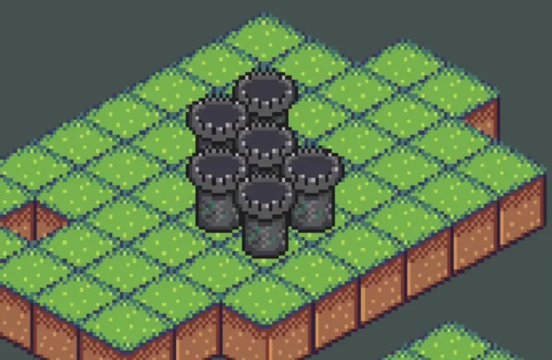
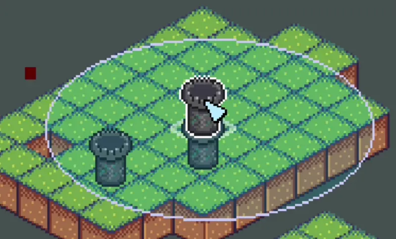

Since I [changed the Rings project to be an isometric tower defense](/blog/a-big-turn-in-the-rings-project) , I've been having some problems with the 2D representation of things in this perspective. Why, you may ask? The thing is that the isometric view is exactly what I described—a representation of the actual 2D top-down game. However, when I started this project, I wasn't considering that isometric would entail more than just a different way of drawing. Unfortunately, this oversight has led to some coding issues

# The beginning of the problem

When I first started making changes to the project's categories, I was only thinking about the mouse interaction with the isometric tiles. So, I followed a tutorial to accomplish this and continued from there.

Initially, my focus was primarily on how the mouse was interacting with the units on those tiles. I considered aspects such as hover detection and the potential problems that could arise, such as:

- What if the unit is taller than the tile? How can I prevent the selection from going to the wrong tile?
  
- What if there's a unit positioned behind another unit? How can I select the intended one?
  

These small problems overshadowed the magnitude of the challenge I was facing.

# The realization

I implemented the unit placement and deletion functionalities, created a simple targeting system, and developed a Bullet class. I was about to start working on the actual defense mechanisms that the towers would perform.

Next, I began coding the system responsible for firing at the target as soon as it entered the unit's range. However, I encountered a roadblock and couldn't figure out a simple solution. On the surface, it was just a matter of calculating the intersection of circles. Yet, inexplicably, I couldn't make it work.

To create the range ellipse, I used an ellipse since the game had an isometric view. Technically, it wasn't a perfect circle. However, I found myself attempting to calculate ellipse intersections using 2D positions, needlessly complicating everything.

Eventually, when I stopped working on the project, I started reflecting on the issue.

> The state of enemy detection
> 

If I have the 2D grid of every tile and the tile position of every unit, why not calculate the range intersection in the top-down view of the tiles and then convert this result later before rendering?

That's precisely what I have started implementing this week as I return to the project after almost a year.

# Let's start by looking at things

Something that has always facilitated this kind of implementation for me is the visualization of the context. Whether it's a simple `print` statement to display the behavior of a variable or even coloring a `<div>` to understand how it affects the entire website's layout (yes, that has happened).

That's why I've decided to develop a top-down debug view for the game. This will not only facilitate the new implementation but also aid in understanding future features and identifying bugs. It's currently a work in progress.

The debug view has helped me realize the issue with my current approach to the isometric perspective. I was constantly thinking in isometric terms instead of considering the underlying 2D representation. In reality, the isometric view doesn't actually exist!

I encountered significant difficulties in determining the actual 2D positions of the elements, to the extent that I had to revisit sections of the code to understand how things were placed, drawn, and recognized in the game.

Questions like how the mouse determines the tile it is hovering over, how the tiles are stored to create a grid, and how to convert coordinates into tile positions (matrix positions) prompted me to reconsider a substantial portion of our rendering and computing pipeline.

> The complexity of the current pipeline far outweighs the simplicity it is meant to achieve."

# Get a step back and rethink the pipeline

Basically, my current plan is to refactor all the isometric-related code to create a simpler pipeline that the entire game can follow, and one that can be easily modified if necessary.

I will store the tile position of every entity and transform it to isometric coordinates during rendering.

> The current debug view 

Another issue I encountered is the abundance of variables that complicate matters. For instance:

Should the `Unit` class store both `screen_position` and `tile_position`? If I only need the screen position when necessary, wouldn't it be better to transform it dynamically? I don't believe it would require excessive computing power.

```python
class Unit(Entity):
	tile_position: Vector
	screen_position: Vector`
```

---

<!-- ![[Screenshot 2023-06-24 at 21.40.08.png]] -->

Why am I passing the game to the `UnitManager` instance? And why did I name the parameter `window`?

```python
class UnitManager:
	def __init__(self, window):
 		self.selected_unit = None
		self.window = window

class Game:
	def __init__(self):
		self.unit_manager = UnitManager(self)
```

As I rewrite this _Top-down to Isometric Logic_, I'm likely to come across more nonsensical code here and there. But for now, that's the plan.

Now, I'll proceed to complete my top-down visualization as I once again refactor this code. Take care not to disrupt your own pipeline in your project!
